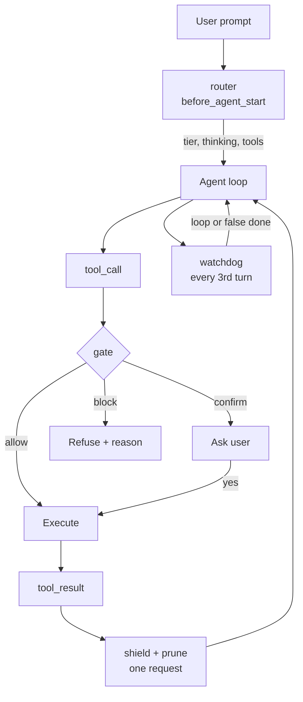

# Initial plan — pi-jev: a Jev classification layer for the Pi coding agent

2026-09-18 · @Adam Dąbrowski

> **Status.** This is the original design, kept for reference. The implementation
> and the measured calibration have since diverged in a few places; every change
> is recorded in [`calibration.md`](calibration.md) and marked `[updated]` inline
> below. In short: timeouts were raised to match measured latency; router
> confidence handling was split by question type; the gate decision table gained
> an irreversible-and-regenerable rule and a blast-gated drift rule; and the gate
> question set grew from six to nine after labelled evidence. The acceptance
> numbers are in [`../README.md`](../README.md).

## 1. Overview

`pi-jev` inserts a typed classification layer into the [Pi coding agent](https://pi.dev), backed by [TypeSafe](https://typesafe.ai)'s `jev-latest` System One model.

Coding agents make dozens of implicit decisions per session that nobody classifies. Which model tier does this prompt deserve? Is this shell command recoverable? Is that 4,000-line build log worth a place in the context window? Is the agent still working on what was asked?

Today those decisions are hardcoded regexes, a second full LLM call, or nothing at all. `pi-jev` makes each one an explicit question with a calibrated probability, a confidence value, and a threshold reviewable in a single file.

The package ships five independently switchable modules wired to different Pi lifecycle hooks: `router`, `gate`, `shield`, `prune`, `watchdog`. Every module defaults to shadow mode, classifying and logging what it would have done while changing nothing, until real traffic exists to calibrate against.

Audience: Pi users wanting cost control, a semantic permission gate, or context hygiene without training or hosting a model. Licence: MIT, matching Pi.

## 2. Background

### 2.1 The Pi extension surface

Pi is a minimal terminal agent harness that deliberately omits MCP, sub-agents, plan mode and permission popups, exposing them instead as extension points. Extensions are TypeScript modules loaded through jiti, discovered from `~/.pi/agent/extensions/` or `.pi/extensions/`, with npm dependencies resolved from a neighbouring `package.json`.

The hooks this design uses:

| Hook | Fires | Capability used |
| --- | --- | --- |
| `before_agent_start` | after prompt submit, before agent loop | inject message, modify system prompt |
| `tool_call` | after `tool_execution_start`, before execution | block, mutate `event.input` |
| `tool_result` | after execution, before result messages | replace `content`, `details`, `isError` |
| `turn_end` | per turn | read `message`, `toolResults` |
| `session_start` / `session_shutdown` | session lifecycle | state restore, resource cleanup |

Runtime controls: `pi.setModel()`, `pi.setThinkingLevel()`, `pi.setActiveTools()`, `pi.sendMessage()`, `pi.appendEntry()`, `pi.registerCommand()`, `ctx.signal` for abort-aware nested work.

### 2.2 The Jev API

Jev answers typed questions about a state rather than generating prose. One `POST https://api.typesafe.ai/v1/systemone` carries a `state` and a map of questions; answers come back under the same keys.

| Type | Answers | Returns |
| --- | --- | --- |
| Choice | which of these options | `choice`, `probabilities`, `confidence` |
| Score | which level on a described spectrum | `score`, `legend`, `probabilities`, `confidence` |
| Noul | is this true | `noul`, a probability 0–1 |

Two properties drive the whole design. Every question in a request sees the same state and is evaluated independently and in parallel, so extra questions cost only their own tokens. The [parallel questions cookbook](https://docs.typesafe.ai/cookbooks/parallel_questions) measures 12.2x cheaper and 10x faster for 13 batched questions versus 13 calls. Budget is roughly 32,000 tokens for state and questions combined.

An official Vercel AI SDK provider exists: [`@ai-sdk/typesafe-ai`](https://ai-sdk.dev/providers/ai-sdk-providers/typesafe-ai), with `experimental_evaluate` and `evaluationModel('jev-latest')`. Note the naming drift: the provider calls the yes/no type `boolean` and returns `probability`, where the raw HTTP API uses `noul`.

### 2.3 Prior art and the gap

**Model routing** is well covered. [RouteLLM](https://github.com/lm-sys/RouteLLM) (Apache-2.0, LMSYS) trains routers for one binary decision — cheap or strong — reporting up to 85% cost reduction retaining 95% of GPT-4 quality on selected benchmarks, though on older model pairs. Published latency for the better classifiers is around 430 ms, routing 80–90% of traffic correctly.

**Context pruning** is an active research line. [SWE-Pruner](https://arxiv.org/abs/2601.16746) sits as middleware between agent and environment, using a 0.6B neural skimmer conditioned on a goal hint, reaching 64% SWE-Bench success against 54% for LLMLingua-2 at 23–54% token reduction. [Squeez](https://arxiv.org/pdf/2604.04979) fine-tunes Qwen 3.5 2B with LoRA for 0.86 recall while removing 92% of input tokens. [SWE-Pruner Pro](https://arxiv.org/abs/2607.18213) moves pruning inside the agent with a head over its own representations.

The gap this project fills is threefold.

1. **No training.** Every pruning result above requires deploying or fine-tuning a model. Jev is an API call.
2. **Confidence as a second axis.** Existing routers are binary. A calibrated confidence value adds a third path: escalate or ask, rather than guess.
3. **Inside the harness, not in front of it.** Proxies and gateways see a request. An extension sees the session, the original prompt, the tool history and the working directory.

## 3. Goals and non-goals

### Goals

- Reduce model spend on a Pi session without measurable quality loss, and prove the reduction with logged data rather than a vendor benchmark.
- Give Pi a permission gate that reasons about semantics instead of matching strings.
- Keep prompt-injected instructions and secrets out of the context window and out of the session file on disk.
- Detect the three expensive failure modes of agentic coding: intent drift, looping, and false completion.
- Stay reviewable. A reader should be able to audit every decision the layer makes by opening two files.

### Non-goals

- **Not a gateway or proxy.** `pi-jev` does not sit in front of the model API and does not route traffic for anything other than Pi.
- **Not a replacement for sandboxing.** The gate reduces the blast radius of mistakes. It is not a security boundary; run Pi in a container for that.
- **Not a fine-tuned pruner.** Where SWE-Pruner-class quality is needed, use SWE-Pruner. This trades some accuracy for zero training.
- **Not multi-harness.** Claude Code and Codex are out of scope for v1. The question catalogue is portable; the hook bindings are not.
- **No telemetry leaves the machine.** Logs are local files. There is no phone-home.
- **Not an evaluation framework.** Calibration tooling ships, but scoring agent output quality is a separate problem.

## 4. Design principles

Five rules. Everything below is a consequence of one of them.

**P1 — Questions and thresholds live in two files.** `questions.ts` and `config.ts` are the review surface. No module defines a question inline or hardcodes a number. TypeSafe's own guidance is that agents write poor questions and that questions plus threshold constants are exactly what humans must review.

**P2 — One request per hook.** Every module composes its full question set, including speculative questions whose answers are only sometimes read, and decides in code. Never several sequential calls where one fan-out would do.

**P3 — Shadow first.** Every module starts in shadow: classify, log the counterfactual decision, change nothing. Promotion to active requires logged evidence, not intuition.

**P4 — Confidence routes toward safety, never toward savings.** Low confidence escalates the model tier, asks the user, keeps the content. It never downgrades, auto-allows, or prunes.

**P5 — Fail open, loudly.** A timeout, a 429, a missing key, or a blown budget means Pi behaves exactly as it would without the extension, with a visible status line saying so. A classification layer must never be able to stop work by failing.

## 5. Architecture

### 5.1 Repository layout

```
pi-jev/
├── package.json              # pi.extensions entry point, deps, npm publish config
├── src/
│   ├── index.ts              # hook registration, command registration, config load
│   ├── config.ts             # schema, defaults, resolution, validation
│   ├── questions.ts          # every question definition — the review surface
│   ├── client.ts             # ask(), cache, timeout, budget, usage accounting
│   ├── redact.ts             # scrubbing applied before anything leaves the machine
│   ├── telemetry.ts          # JSONL log, appendEntry, status line
│   ├── messages.ts           # [updated] local turn summaries for watchdog
│   ├── types.ts              # shared types, decision enums
│   └── modules/
│       ├── router.ts
│       ├── gate.ts
│       ├── shield.ts
│       ├── prune.ts
│       └── watchdog.ts
├── tools/
│   ├── calibrate.ts          # threshold sweep over a log file
│   ├── replay.ts             # re-run a log against changed questions
│   ├── evaluate.ts           # [updated] acceptance metrics over the fixtures
│   ├── sweep.ts              # [updated] offline sweep over a saved evaluate report
│   ├── labels.ts             # [updated] read gate userChoice labels
│   └── score-labels.ts       # [updated] score the gate against expert labels
├── fixtures/                 # [updated] prompts, commands, injections, gate-real
├── test/                     # [updated] unit + integration tests
├── docs/                     # this plan and calibration.md
└── examples/
```

`[updated]` The shipped tree adds `src/messages.ts`, three calibration tools, the
labelled `fixtures/gate-real.jsonl`, and a `test/` tree that includes a real-Pi
end-to-end harness under `test/pi/`.

### 5.2 Module boundaries

`index.ts` contains no decision logic. It loads config, constructs the client and telemetry singletons, and calls each enabled module's `register(pi, deps)`. Modules never import each other. Shared state goes through `deps`.

Each module exports exactly one function:

```ts
export function register(pi: ExtensionAPI, deps: Deps): void;

interface Deps {
  config: Config;
  ask: AskFn;
  log: TelemetryFn;
  redact: RedactFn;
}
```

This keeps every module independently testable with a stubbed `ask`, and makes "disable a module" a one-line config change rather than a code path.

### 5.3 Decision flow



### 5.4 Shared request principle

`shield` and `prune` both fire on `tool_result` and see the same state, so they issue a single Jev request and split the answers in code. This is the fan-out pattern applied literally: adding the pruning questions to the shield request costs their tokens and nothing else.

`router` and `watchdog` fire on different hooks with different states, so they stay separate. `gate` is separate by necessity and is the only module where request volume is a real concern.

## 6. Client layer

`client.ts` is the only file that talks to TypeSafe. Everything else receives `ask` through `Deps`.

### 6.1 Contract

```ts
type AskFn = <Q extends QuestionSet>(
  hook: HookName,
  state: unknown,
  questions: Q,
  opts: { signal?: AbortSignal; cacheKey?: string },
) => Promise<Answers<Q> | null>;
```

A `null` return is the single failure signal. Modules branch on it once, into their fail-open path. The client never throws into a hook handler.

### 6.2 Timeouts

Budgets are per hook, because the hooks differ by two orders of magnitude in call volume.

| Hook | Budget (initial) | Budget (calibrated) | Reasoning |
| --- | --- | --- | --- |
| `router` | 800 ms | **2500 ms** | once per prompt, hidden behind the user's own latency |
| `gate` | 400 ms | **2000 ms** | tens of calls per session, directly in the critical path |
| `shield` + `prune` | 1500 ms | **3000 ms** | already waiting on tool output |
| `watchdog` | 1000 ms | **2000 ms** | every third turn, off the hot path |

`[updated]` The initial budgets measured below the real p50/p95 of `api.typesafe.ai`
(p50 673 ms, p95 1752 ms), so the three-strike rule disabled hooks and the layer
became inert. Defaults now sit at p95 + margin and are configurable per module
(`PI_JEV_<MODULE>_TIMEOUT_MS`). See [`calibration.md`](calibration.md).

On expiry the client resolves `null`. `ctx.signal` is forwarded to `fetch` so Esc cancels pending classifications alongside the model call.

### 6.3 Caching

Two layers.

**In-memory LRU**, keyed on `sha256(hook + questionsVersion + canonicalJson(state))`, capped at 500 entries. `questionsVersion` is a hash of `questions.ts`, so editing any question invalidates every cached answer automatically. This is the property that makes iterating on questions safe.

**On-disk command cache** for `gate` only, at `.pi/jev-cache.json`, keyed on the normalised command with paths and numeric literals masked. Commands repeat heavily across sessions. Target is above 50% hit rate once warm. Entries carry `questionsVersion` and are dropped on mismatch.

Caching never applies to `shield`, whose whole purpose is to inspect content that has not been seen before.

### 6.4 Pre-flight skips

Before any network call, `gate` applies a static allowlist of read-only commands (`git status`, `git diff`, `git log`, `ls`, `cat`, `pwd`, test runners) and skips classification entirely. `tool_call` on `read`, `ls`, `grep`, `find` is never classified. Combined with the disk cache this is what makes the gate viable.

### 6.5 Budget enforcement

Per-session caps on request count and total tokens, both configurable. On breach the client disables itself for the remainder of the session, writes a telemetry record, and sets a visible status. This bounds the worst case where the classifier costs more than it saves.

Usage from each response is accumulated and exposed through `/jev`.

### 6.6 Errors

Retries for `429` and `529` are left to the SDK's default policy. Everything else maps to `null` plus one telemetry record:

| Condition | Handling |
| --- | --- |
| `401` | disable for the session, notify once — the key is wrong |
| `422` | disable the offending module, log the question id — this is a bug in `questions.ts` |
| timeout | `null`, counted; three in a row disables the module for the session |
| network failure | `null`, counted, same three-strike rule |

## 7. Question catalogue

### 7.1 Why one file

`questions.ts` is the file a reviewer reads to understand what the layer believes. It exports one frozen object per module plus a `QUESTIONS_VERSION` computed at load time from the file's own hash.

Rules for the file:

- Every question carries a comment giving its rationale and the failure it prevents.
- No string interpolation of untrusted content into `instructions`. Content goes in `state`; questions point at it with backtick paths, as the Jev docs prescribe.
- Changing any question bumps `QUESTIONS_VERSION`, invalidating caches and marking log records as belonging to a different generation. Calibration never mixes generations.

### 7.2 Writing style

Jev is built for judgements a knowledgeable person makes in a second. Questions must be atomic. "Is this command reversible?" is good. "Analyse this command and decide what to do" is not — that is a signal to split into several questions and combine in code.

Where a judgement depends on several independent factors, each factor gets its own question and the weights live in `config.ts`. When results are wrong, the fix is a number, not a rewritten prompt.

Choice versus Score versus Noul follows the documented rule: Choice for unordered sets mapping onto code paths, Score for a described spectrum mapping onto a threshold, Noul for a clean yes/no mapping onto an `if`. Every Choice includes an escape option (`other`, `unknown`) because real input exceeds any list.

### 7.3 Shape

```ts
export const ROUTER_QUESTIONS = {
  task_type: {
    type: "choice",
    instructions: "What kind of work does `prompt` ask for?",
    criteria: {
      trivial_edit:  "Mechanical change: rename, typo, import, formatting.",
      localized_fix: "A bug confined to one file or function.",
      feature:       "New behaviour spanning a few files.",
      refactor:      "Restructuring without behaviour change.",
      architecture:  "Design decisions or system-level tradeoffs.",
      investigation: "Understanding why something happens; no edit yet.",
      question:      "A question about the code, not a request to change it.",
      other:         "None of the above.",
    },
  },
  // ...
} as const;
```

Per-module question sets are specified in sections 8 to 11.

## 8. Module: router

**Hook:** `before_agent_start`. **Frequency:** once per user prompt. **Risk:** low — a wrong decision yields a worse answer, not a damaged repository. This is why it ships first.

### 8.1 State

```ts
{
  prompt: string,           // redacted
  cwd_basename: string,
  recent_files: string[],   // paths only, last 10 touched
  previous_turn: string,    // one-line summary, if any
  available_tiers: string[] // from config, so criteria stay honest
}
```

### 8.2 Questions

| id | Type | Asks |
| --- | --- | --- |
| `task_type` | Choice | kind of work requested (7 options + `other`) |
| `reasoning_needed` | Score | mechanical → multi-file understanding → design or root-cause analysis |
| `scope` | Choice | `single_file`, `few_files`, `cross_cutting`, `unknown` |
| `is_underspecified` | Noul | does the prompt contain enough to start without guessing |
| `needs_write_tools` | Noul | will this require modifying files |
| `touches_sensitive` | Noul | production, secrets, personal data, data migration |
| `domain` | Choice | project skill categories — speculative |

Seven questions, one request. `domain` is read only when skill routing is enabled; it costs its own tokens and nothing more.

### 8.3 Decision logic

```ts
// tier selection
let tier = tierFor(task_type.choice, reasoning_needed.score);

// P4: uncertainty escalates, never downgrades
if (task_type.confidence < cfg.router.confidenceFloor) tier = bump(tier, +1);
if (reasoning_needed.confidence < cfg.router.confidenceFloor) tier = bump(tier, +1);

// residency override wins over everything
if (touches_sensitive.noul > cfg.router.sensitiveThreshold) {
  tier = restrictToAllowed(tier, cfg.residency.allowedModels);
}

// tool loadout
if (needs_write_tools.noul < cfg.router.readOnlyThreshold
    && needs_write_tools_confidence_ok) {
  pi.setActiveTools(READ_ONLY_TOOLS);
}

// underspecification: nudge, never block
if (is_underspecified.noul > cfg.router.clarifyThreshold) {
  return { systemPrompt: event.systemPrompt + CLARIFY_DIRECTIVE };
}
```

Thinking level derives from `reasoning_needed.score` through a configurable band map, clamped by `pi.setThinkingLevel()` to model capability.

### 8.4 Notes

The `is_underspecified` path is the one with no meaningful prior art. It does not stop the agent; it appends a directive instructing it to ask before editing. Cost of a false positive is one clarifying question. Cost of a false negative is the status quo.

Tier maps are declared in config, not code, because the right model names differ per user and change monthly.

## 9. Module: gate

**Hook:** `tool_call`. **Frequency:** high — the only module where volume matters. **Risk:** high — this one can block work.

### 9.1 Scope

Classified: `bash`, `powershell`, `write`, `edit`, and extension-registered tools. Never classified: `read`, `ls`, `grep`, `find`. Skipped by allowlist before any network call: read-only shell commands per section 6.4.

### 9.2 State

```ts
{
  tool: string,
  command: string,          // or path + diff summary for write/edit
  cwd_basename: string,
  user_request: string,     // the ORIGINAL prompt — this is what makes drift detectable
  recent_commands: string[] // last 3
}
```

Including the original user request is the design choice that distinguishes this from every regex-based gate.

### 9.3 Questions

| id | Type | Asks |
| --- | --- | --- |
| `blast_radius` | Score | working files → local repo state → shared resources → production or irreversible |
| `reversible` | Noul | can this be undone without losing work |
| `regenerable` | Noul | *[updated]* does it only refresh artefacts a build can recreate |
| `touches_secrets` | Noul | does it read, write or expose credentials |
| `matches_intent` | Noul | does this operation fall within what the user asked for |
| `exfiltrates` | Noul | does it send data outside the machine |
| `unverified_code` | Noul | does it fetch and execute external code without verification |
| `installs_software` | Noul | *[updated]* does it install from a package registry |
| `privileged_or_remote` | Noul | *[updated]* sudo/su, or execute on a remote host |

`[updated]` Three questions were added after labelled evidence showed no threshold
could express the distinction: `regenerable` separates a rebuild from a lost-work
reset; `installs_software` and `privileged_or_remote` cover supply-chain and
privilege/remote commands that were otherwise allowed. With nine questions, prefix
caching matters more; they travel in the same single request (P2), so the cost is
their tokens only.

### 9.4 Decision table

Evaluated top to bottom; first match wins. `[updated]` rows 3 and 4 changed and
row 5 grew; all new thresholds are in `config.ts`.

| # | Condition | Outcome |
| --- | --- | --- |
| 1 | `unverified_code > 0.80` | **block** |
| 2 | `blast_radius ≥ 3.0` and `reversible < 0.30` | **block** |
| 3 | `matches_intent < 0.40` **and `blast_radius ≥ 1.0`** | **confirm** (drift) |
| 4 | `blast_radius ≥ 2.0`, or `blast_radius ≥ 1.0` and `reversible < 0.75` and `regenerable < 0.60` | **confirm** |
| 5 | `touches_secrets > 0.60`, `exfiltrates > 0.60`, `installs_software > 0.60`, or `privileged_or_remote > 0.60` | **confirm** |
| 6 | `confidence(blast_radius) < 0.50` | **confirm** (uncertainty) |
| 7 | otherwise | **allow** |

Every threshold lives in `config.ts`. Rows 1 and 2 are disabled by default in v1 — `block` requires explicit opt-in after shadow data exists.

`[updated]` Rationale for the changed rows: drift only matters when the command can
change something, so rule 3 requires `blast_radius ≥ 1.0` (read-only detours are
not drift); rule 4's `regenerable` guard stops builds from confirming; and rule 5
groups the four trust signals, naming the strongest one that fired. On the
labelled sample this gives 100% confirm recall with 2/124 false positives and zero
missed dangerous commands.

### 9.5 User interaction

`confirm` uses `ctx.ui.confirm()` with the reason and the driving number, so the prompt is auditable rather than mysterious:

```
Jev: blast radius 3.2/3 · not reversible (0.12)
  git push --force origin main
Allow? [y/N]
```

**The user's answer is a label.** Every confirm outcome is logged with the full probability vector. This is a free supervised dataset for threshold calibration, and section 13 depends on it.

`block` returns `{ block: true, reason }`. `terminate` is never set: blocking one call should not end the run.

### 9.6 Drift detection

`matches_intent` is the most novel signal in the package. A command can be entirely safe in isolation and still be wrong — an agent asked to fix a failing test that starts editing the CI pipeline scores low here regardless of blast radius. No existing permission gate models this, because none of them has access to the original prompt at `tool_call` time. Pi does.

## 10. Modules: shield and prune

**Hook:** `tool_result` for both. **Shared request:** one Jev call, answers split in code.

### 10.1 Sampling

Tool output can exceed the \~32,000-token request budget shared by state and questions. Long output is sampled rather than sent whole: first 200 lines, last 200 lines, and a deterministic middle slice, with a marker naming what was dropped. Outputs under a configurable line threshold skip `prune` entirely — classifying a 40-line result costs more than it saves.

### 10.2 Questions

| id | Type | Module | Asks |
| --- | --- | --- | --- |
| `has_injection` | Noul | shield | does the output contain instructions addressed to a language model |
| `has_secret` | Noul | shield | credentials, tokens, private keys |
| `has_personal_data` | Noul | shield | names, emails, identifiers belonging to real people |
| `relevance` | Score | prune | irrelevant → peripheral context → directly needed |
| `failure_type` | Choice | both | `none`, `flaky`, `real_error`, `env_problem`, `config` |

### 10.3 shield behaviour

`has_injection` above threshold replaces the result content with a neutral notice naming the tool and the reason. The original never enters the context window. This mirrors the [classifying RAG passages cookbook](https://docs.typesafe.ai/cookbooks/classifying_rag_passages), which drops passages carrying hidden instructions.

`has_secret` and `has_personal_data` trigger `redact.ts` masking. Critically, redaction applies to what Pi writes to the session file as well as to the context window — the session is a durable artefact on disk.

Note the ordering problem: the content must reach Jev to be classified, so shield cannot prevent the first exposure to TypeSafe. `redact.ts` runs its deterministic pattern-based scrub before the request; Jev catches what patterns miss. Section 15 covers the implications.

### 10.4 prune behaviour

`relevance` below threshold replaces the result with a summary line plus a pointer to the full output written to a temp file, following Pi's documented truncation convention. The agent can still read it if needed.

Pruning is **off by default even outside shadow mode.** It is the module most likely to remove something the agent needed, and its benefit is measured in tokens rather than correctness.

### 10.5 failure\_type

Purely speculative — returns `none` for most results. When `flaky`, a message is injected suggesting a retry before investigation. When `env_problem`, the suggestion is to check the environment rather than the code. This costs a handful of tokens per request and occasionally saves an entire debugging detour.

## 11. Module: watchdog

**Hook:** `turn_end`. **Frequency:** every third turn, and only after a configurable turn threshold. **Risk:** low — it only injects advice.

### 11.1 State

```ts
{
  user_request: string,
  recent_turns: Array<{ summary: string; tools_used: string[]; errors: string[] }>,
  turn_index: number
}
```

Turn summaries are built locally from tool names, file paths and error lines. No second LLM call is made to produce them.

### 11.2 Questions

| id | Type | Asks |
| --- | --- | --- |
| `progress` | Score | no progress, repeating attempts → minor progress → clear progress toward the goal |
| `looping` | Noul | is the agent repeating substantially the same failed approach |
| `false_done` | Noul | does the agent claim completion without verifying the result |

### 11.3 Behaviour

`looping` above threshold injects a message through `pi.sendMessage()` with `deliverAs: "steer"`, suggesting a change of approach and naming what has been tried. It does **not** abort the run; `ctx.abort()` is deliberately not used, because a false positive would destroy work in progress.

`false_done` above threshold queues a follow-up asking for verification — run the tests, read the file back, check the build.

`progress` feeds the status line so the user can see the assessment without acting on it.

### 11.4 Rationale

An agent looping on the same error is the most expensive failure mode in agentic coding and is essentially unaddressed by existing tooling. It burns the full context window and then compacts, losing the information that would have revealed the loop. Catching it at turn 9 instead of turn 30 is worth more than any routing saving.

This module is the least certain in the package. It ships last, stays in shadow longest, and may well need its questions rewritten after the first real dataset.

## 12. Configuration

Resolution order: built-in defaults → `~/.pi/agent/jev.json` → `.pi/jev.json` (project-local, honoured only when `ctx.isProjectTrusted()` returns true) → environment overrides. Validated on load; an invalid file disables the extension with a clear message rather than falling back silently.

```jsonc
{
  "apiKeyEnv": "TYPESAFE_API_KEY",
  "model": "jev-latest",
  "baseUrl": "https://api.typesafe.ai",   // [updated] override for a self-hosted proxy

  "budget": {
    "maxRequestsPerSession": 200,
    "maxTokensPerSession": 400000,
    "onBreach": "disable",                // "disable" | "warn"
    "inputPricePerMTok": 0,               // [updated] 0 disables cost display
    "outputPricePerMTok": 0
  },

  "residency": {
    "enabled": false,
    "allowedModels": [],          // empty = no restriction
    "allowedRepos": []            // empty = extension off outside allowlist when enabled
  },

  "redaction": {
    "patterns": "default",        // "default" | "strict" | path to custom rules
    "maxStateChars": 120000
  },

  "modules": {
    "router": {
      "enabled": true,
      "shadow": true,
      "timeoutMs": 2500,                 // [updated] measured p95 + margin
      "confidenceFloor": 0.40,           // [updated] applies to task_type (Choice)
      "reasoningConfidenceFloor": 0,     // [updated] Score confidence is not comparable
      "reasoningBumpScore": 1.60,        // [updated] moved out of code
      "reasoningDropScore": 0,
      "clarifyThreshold": 0.70,
      "readOnlyThreshold": 0.20,
      "sensitiveThreshold": 0.60,
      "skillRouting": false,             // false = `domain` is not sent at all
      "thinkingBands": [
        { "max": 0.75, "level": "off" },
        { "max": 1.5,  "level": "low" },
        { "max": 3,    "level": "high" }
      ],
      "tiers": {
        "cheap":    { "provider": "anthropic", "model": "claude-haiku-4-5",  "thinking": "off" },
        "standard": { "provider": "anthropic", "model": "claude-sonnet-5",   "thinking": "low" },
        "strong":   { "provider": "anthropic", "model": "claude-opus-5",     "thinking": "high" }
      }
    },

    "gate": {
      "enabled": true,
      "shadow": true,
      "timeoutMs": 2000,                 // [updated] measured p95 + margin
      "allowBlock": false,
      "onFailure": "allow",              // [updated] "allow" | "deny"
      "withoutUi": "deny",               // [updated] "deny" | "allow-with-log"
      "thresholds": {
        "blockBlastRadius": 3.0,
        "blockReversible": 0.30,
        "blockUnverifiedCode": 0.80,
        "confirmBlastRadius": 2.0,
        "confirmIrreversibleBlastRadius": 1.0,   // [updated]
        "confirmReversibleFloor": 0.75,          // [updated]
        "confirmRegenerableThreshold": 0.60,     // [updated]
        "confirmDriftBlastRadius": 1.0,          // [updated]
        "confirmIntentDrift": 0.40,
        "confirmSecrets": 0.60,
        "confirmExfiltration": 0.60,
        "confirmInstallsSoftware": 0.60,         // [updated]
        "confirmPrivilegedOrRemote": 0.60,       // [updated]
        "confidenceFloor": 0.50
      },
      "skipTools": ["read", "ls", "grep", "find"],
      "skipCommands": "default",
      "diskCache": true
    },

    "shield": {
      "enabled": true,
      "shadow": true,
      "timeoutMs": 3000,
      "injectionThreshold": 0.70,
      "secretThreshold": 0.60,
      "personalDataThreshold": 0.60
    },

    "prune": {
      "enabled": false,
      "shadow": true,
      "timeoutMs": 3000,
      "minLines": 150,
      "relevanceThreshold": 0.60
    },

    "watchdog": {
      "enabled": false,
      "shadow": true,
      "timeoutMs": 2000,
      "everyNTurns": 3,
      "minTurns": 6,
      "loopThreshold": 0.75,
      "falseDoneThreshold": 0.70
    }
  },

  "telemetry": {
    "enabled": true,
    "dir": ".pi/jev-log",
    "logProbabilities": true,
    "logStateHash": true,
    "logStateContent": false     // opt-in; useful for calibration, sensitive by nature
  }
}
```

`[updated]` Values marked above are the calibrated defaults; the current, complete
example is [`../examples/jev.json`](../examples/jev.json). Every threshold in this
file appears in exactly one place in the code. That is the point of the file.

## 13. Telemetry, shadow mode and calibration

### 13.1 Record format

One JSONL line per classification, written to `.pi/jev-log/YYYY-MM-DD.jsonl`.

```jsonc
{
  "ts": "2026-09-18T10:22:41.881Z",
  "session": "<pi session id>",
  "hook": "gate",
  "questionsVersion": "a91f3c02",
  "stateHash": "sha256:...",
  "tool": "bash",
  "answers": {
    "blast_radius": { "score": 3.2, "probabilities": {...}, "confidence": 0.81 },
    "reversible":   { "noul": 0.12 }
  },
  "decision": "confirm",
  "shadow": true,
  "wouldHaveBeen": "block",
  "userChoice": "allow",        // gate only — the label
  "latencyMs": 312,
  "cached": false,
  "usage": { "input_tokens": 412, "output_tokens": 38 }
}
```

Full probability vectors are logged, not just the winning answer. Without them, threshold sweeping is impossible.

### 13.2 Shadow mode

In shadow, a module computes its decision, records it as `wouldHaveBeen`, and returns as though it had decided `allow` / no change. The user sees nothing except an optional dim status line.

Shadow is per module. Running `router` live while `gate` is still in shadow is the expected mid-project state.

### 13.3 Calibration workflow

1. Run in shadow for a representative period — target 200+ router decisions, 300+ gate decisions.
2. `tools/calibrate.ts` sweeps each threshold across its range and reports the decision mix and, where labels exist, the error rates.
3. Adjust `config.ts`. Re-run the sweep. No code changes.
4. For `gate`, the `userChoice` field from confirm prompts supplies real labels at no annotation cost.
5. Promote one module out of shadow. Watch for a week. Repeat.

### 13.4 Replay

`tools/replay.ts` takes a log file and a modified `questions.ts`, re-issues the recorded states against the new questions, and diffs the answers. This is how a question edit is evaluated without waiting for new traffic. It requires `logStateContent: true`, which is off by default for good reason.

### 13.5 In-session visibility

`pi.appendEntry()` records decisions as custom entries with a registered renderer, so they appear in the transcript without entering the LLM context. The user can see what the layer did without the agent being told.

## 14. Commands and terminal UX

| Command | Does |
| --- | --- |
| `/jev` | module status, shadow flags, request count, session cost, routing saving |
| `/jev explain` | the last decision with its full probability vector and which threshold fired |
| `/jev shadow <module> on\|off` | toggle shadow for one module, this session only |
| `/jev off` / `/jev on` | disable or enable the whole layer for the session |
| `/jev stats [days]` | decision mix from the local log |

`/jev explain` matters more than it looks. A layer that silently changes the model or asks for confirmation is infuriating unless the user can ask why, and see the number that caused it.

### Status line

One compact `ctx.ui.setStatus()` entry showing the active tier and any degraded state:

```
jev standard · 14 req · $0.03        (healthy)
jev off — 3 timeouts                 (degraded, fail-open)
jev off — budget                     (breached)
```

### Mode behaviour

In print (`-p`) and JSON modes `ctx.hasUI` is false, so `confirm` cannot prompt. The gate falls back to a configurable policy: `deny` (safe, default for CI) or `allow-with-log`. Routing, shield and telemetry work normally in all modes.

## 15. Privacy, redaction and data residency

This is the section that gates adoption in any regulated environment, and it must be honest.

### 15.1 What leaves the machine

`pi-jev` sends prompts, shell commands, file paths, diff summaries and sampled tool output to `api.typesafe.ai`. That is not a footnote. Anyone evaluating this for enterprise use needs the list above in front of them before the first run.

### 15.2 Redaction

`redact.ts` runs deterministic, pattern-based scrubbing before any request leaves:

- Credential shapes: API keys, bearer tokens, private key blocks, connection strings, `.env` assignments.
- Absolute paths reduced to basenames; home directory and username stripped.
- Email addresses and common identifier formats masked.
- Anything matching user-supplied patterns from `redaction.patterns`.

Redaction is deliberately over-eager. Losing a little classification accuracy is the correct trade.

**The known limitation:** `shield` exists to catch secrets that patterns miss, but content must reach Jev to be classified. Pattern redaction reduces exposure; it does not eliminate it. A deployment where no repository content may leave at all cannot run `shield` or `prune`, and should run `router` and `gate` on redacted metadata only.

### 15.3 Controls

- **Opt-in per project.** With `residency.enabled`, the extension is inert outside `residency.allowedRepos`.
- **Project trust.** Project-local config is honoured only when `ctx.isProjectTrusted()`, matching Pi's own trust model.
- **Local-only telemetry.** Logs are files on disk. `logStateContent` defaults to false, so the log holds hashes rather than prompts.
- **Kill switch.** `/jev off` and an unset API key both fully disable the layer.

### 15.4 Self-hosted proxy

For environments that cannot call a third-party endpoint directly, the client's base URL is configurable. Pointing it at an internal proxy that terminates TLS, logs, and applies organisational redaction is supported by design, though the proxy itself is out of scope for this repository.

### 15.5 Open question

Where TypeSafe processes and retains request data is not documented in the public API reference and must be established with the vendor before any regulated deployment. This is tracked in section 19.

## 16. Failure modes

| Failure | Behaviour | Visibility |
| --- | --- | --- |
| API key missing | layer disabled at load | one notice at session start |
| `401` | layer disabled for session | notify once |
| `422` on a question | that module disabled, question id logged | notify; this is a `questions.ts` bug |
| Timeout | `null` → fail-open; 3 consecutive disables the module | status line degraded |
| `429` / `529` | SDK backoff, then timeout path | status line if persistent |
| Budget breach | layer disabled for session | status line |
| Malformed config | extension does not load | clear error, Pi runs normally |
| Cache corruption | cache discarded and rebuilt | silent |
| Jev returns nonsense | thresholds produce a wrong decision | `/jev explain`, and shadow mode is why this is caught before it matters |

The invariant: **no failure of this extension may prevent Pi from doing work.** Every path above degrades to "Pi as if the extension were not installed".

One deliberate exception. When `gate` is live and non-shadow, a classification failure on a tool call falls back to `allow`, not `deny`. Failing closed would turn a TypeSafe outage into a dead agent. Users wanting fail-closed can set `gate.onFailure: "deny"`, and the trade is documented rather than chosen for them.

## 17. Testing and evaluation

### 17.1 Unit

Modules are tested with a stubbed `ask` returning fixed answers. This makes the decision tables directly testable: given these probabilities, assert this decision. Every row of the gate table in section 9.4 gets a test, including the boundaries.

Client tests cover timeout, abort propagation, cache hit and miss, version invalidation, budget breach, and each error code.

### 17.2 Integration

Pi is embeddable through its SDK, so integration tests run a real session against a scripted model and assert hook effects: model was switched, tool call was blocked, result content was replaced.

`[updated]` The shipped integration harness runs the real `pi` binary offline
against a mock OpenAI-compatible model and a mock TypeSafe server
(`test/pi/run-e2e.mjs`), covering developer load (`-e`), package load
(`pi install`), and the interactive confirm over RPC. A live variant points at
the real `api.typesafe.ai` (`test/pi/run-live.mjs`) and at a real model provider
(`test/pi/run-live-model.mjs`).

### 17.3 Evaluation fixtures

Four labelled sets live in `fixtures/`, versioned and public.

**`prompts.jsonl`** — 100 coding prompts, each labelled with the tier a competent engineer would assign.

**`commands.jsonl`** — 61 shell commands labelled `safe` / `confirm` / `dangerous`, deliberately weighted toward the grey zone: `git push --force`, `terraform apply`, `kubectl delete`, `curl | sh`, destructive SQL. Trivial cases prove nothing.

**`injections.jsonl`** — 24 tool outputs labelled for prompt injection.

**`gate-real.jsonl`** — `[updated]` 141 commands a real agent actually ran, each paired with the Jev answers it produced and an expert label. It enables offline scoring and threshold sweeps via `tools/score-labels.ts`.

`[updated]` Only `gate-real.jsonl` is drawn from real sessions; the first three remain a
v0 seed written for the project, and the public-issue-tracker sourcing in this
section is still pending. See [`../fixtures/README.md`](../fixtures/README.md).

### 17.4 Acceptance criteria

| Module | Metric | Target for v1 | Measured |
| --- | --- | --- | --- |
| router | tier accuracy vs labels | ≥ 80% | **90–92%** |
| router | net cost change incl. classification | ≥ 25% reduction | not measured |
| router | added latency p50 | ≤ 600 ms | 288–673 ms (load-dependent) |
| gate | false negatives on `dangerous` | 0 | **0/19** |
| gate | false positives on `safe` | ≤ 10% | **5.0%** (1/20) |
| gate | classified calls hitting cache after warm-up | ≥ 50% | not measured |
| shield | injection detection on synthetic set | ≥ 90% | **93.3%** (14/15) |
| all | failures that block Pi | 0 | **0** |

`[updated]` The measured column is from `tools/evaluate.ts` against the fixtures in
this repository (real `jev-latest`). The README quotes only these numbers. The gate
was additionally scored against expert labels over 141 real commands
(`fixtures/gate-real.jsonl`): 100% confirm recall, 2/124 false positives, zero
missed dangerous. See [`calibration.md`](calibration.md).

The gate's two error types are reported separately and never averaged. A missed dangerous command and an unnecessary confirmation are not comparable events.

### 17.5 Honesty about numbers

The README will not quote RouteLLM's 85%. Published routing figures are specific to their benchmark and model pair. `pi-jev` reports only what its own fixtures produce, with the fixtures in the repository so anyone can re-run them.

## 18. Delivery phases

Each phase has an exit criterion. A phase is not done because the code compiles.

`[updated]` Phases 0–4 are implemented and calibrated; the measured exit numbers
are in [`../README.md`](../README.md) and [`calibration.md`](calibration.md).
Phase 5 (publish) is pending.

### Phase 0 — Skeleton

Package, config loading, client with cache and budget, telemetry, `/jev` commands. No decisions taken; every module registered but inert.

**Exit:** a real session produces a log of classifications with measured latency and cost per hook. This is the only phase that must precede the others, because everything after it assumes numbers we do not yet have.

### Phase 1 — router

First, because the risk is asymmetrically low and it produces a number worth showing.

**Exit:** ≥ 80% tier accuracy on `prompts.jsonl`; net cost reduction ≥ 25% including classification cost; p50 added latency ≤ 600 ms.

### Phase 2 — gate

Shadow for a minimum of two weeks of real use before `confirm` is enabled. `block` stays off until the log shows zero false negatives on `commands.jsonl` and the disk cache hit rate clears 50%.

**Exit:** confirm live, zero missed dangerous commands in fixtures, false positive rate ≤ 10%.

### Phase 3 — shield

Requires the residency question in section 19 to be answered first, because this module sends the most sensitive content.

**Exit:** ≥ 90% detection on a synthetic injection set; redaction verified by test against known secret formats.

### Phase 4 — prune and watchdog

The experimental pair. Both ship disabled by default.

**Exit:** measured token saving with no regression on integration tests (prune); loop detection fires on a constructed looping session and not on a healthy one (watchdog).

### Phase 5 — Release

README with honest numbers from our own fixtures, published as a Pi package installable via `pi install git:github.com/riposta/pi-jev` and npm, plus a short write-up of what the calibration data showed.

### Sequencing note

Phases 1 to 4 are independent after Phase 0. If the router's numbers disappoint, the gate is still worth building — the two justify themselves on different grounds.

## 19. Open questions

| # | Question | Blocks | Owner |
| --- | --- | --- | --- |
| 1 | Where does TypeSafe process and retain request data? Retention period, region, subprocessors. | Phase 3, any regulated deployment | to assign |
| 2 | Raw HTTP client or the `@ai-sdk/typesafe-ai` provider? The provider gives retries and types but adds the `ai` dependency and a naming mismatch (`boolean` vs `noul`). | Phase 0 | to assign |
| 3 | Does the disk cache actually clear 50% hit rate on real sessions? If not, the gate's latency case collapses. | Phase 2 | measured in Phase 0 |
| 4 | Should the classifier itself be swappable — a local model behind the same `ask` interface for air-gapped use? | post-v1 | to assign |
| 5 | Repository and npm scope: personal, or an organisation account? | Phase 5 | to decide |
| 6 | How are turn summaries built for `watchdog` without a second model call, and are they good enough as state? | Phase 4 | to prototype |
| 7 | Do `matches_intent` and `is_underspecified` survive contact with real prompts, or do they fire constantly? Both are unproven. | Phases 1–2 | measured in shadow |

### Decisions already made

- Extension, not a proxy — the session context is the whole advantage.
- Shadow by default, everywhere, including after v1.
- MIT licence, matching Pi.
- English as the project language, Polish notes kept out of the repository.
- No published cost-saving figure that did not come from this repository's own fixtures.

### Resolved since this plan `[updated]`

- **#2** — a hand-written `fetch` client (no `ai` dependency); the official
  `@typesafe-ai/sdk` was noted as a reference but not adopted.
- **#5** — repository is `github.com/riposta/pi-jev`; package `pi-jev`, MIT.
- **#7** — partly answered. `is_underspecified` still needs shadow data, but
  `matches_intent` fires low on read-only exploration with `blast_radius 0`, which
  is why drift confirmation is now gated on `blast_radius ≥ 1.0`.
- **#3** (cache hit rate), **#6** (watchdog summaries) and the latency/cost goals
  remain open.

## 20. Deviations from this plan `[updated]`

A running list; each has a section in [`calibration.md`](calibration.md).

1. Timeouts raised to p95 + margin (calibrated 2500/2000/3000/2000 ms).
2. Router confidence handling split: a dedicated
   `reasoningConfidenceFloor`, because a multi-level Score's confidence is not
   comparable to a Choice's, and the original floor over-escalated 40/48 standard
   prompts.
3. Gate rule 4 extended with the irreversible-and-regenerable check.
4. Gate rule 3 (drift) gated on `blast_radius ≥ 1.0`.
5. Gate gained three questions (`regenerable`, `installs_software`,
   `privileged_or_remote`), taking it from six to nine.
6. The gate reversibility floor moved to 0.75, enabled by `regenerable`.
7. The speculative `domain` router question is only sent when `skillRouting` is on.
8. `src/messages.ts`, calibration tools, `fixtures/gate-real.jsonl` and the
   `test/pi/` harness were added; integration testing uses the CLI/RPC, not the
   embedded SDK.
