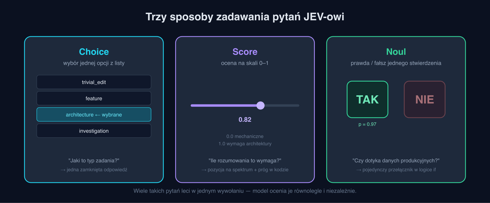
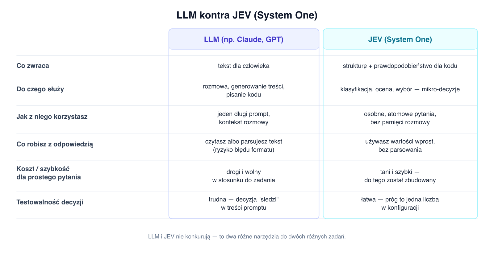
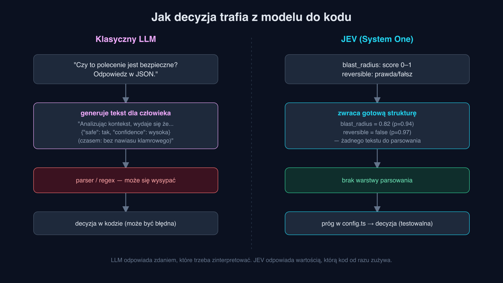
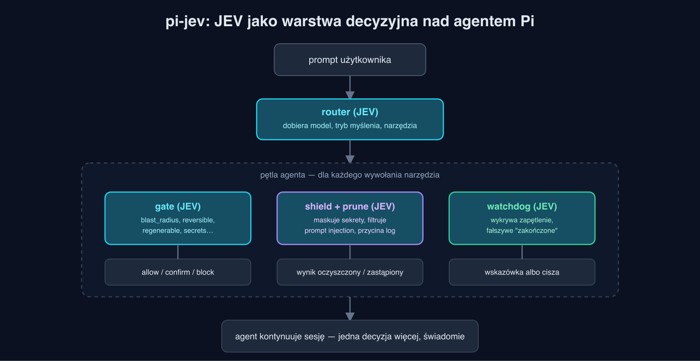

# System One: model AI, który nie gada, tylko decyduje

Kiedy słyszysz "model AI", myślisz pewnie o ChatGPT, Claude albo Gemini — coś, z czym rozmawiasz, co pisze za Ciebie e-maile albo tłumaczy kod. To wszystko są **LLM-y** (Large Language Models) i naprawdę dobrze radzą sobie z jednym zadaniem: generowaniem tekstu dla ludzi.

Ale software rzadko potrzebuje tekstu. Software potrzebuje **decyzji**: tak/nie, 0.0–1.0, opcja A czy B. I tu robi się problem, o którym mało kto mówi głośno: używamy generatorów tekstu tam, gdzie potrzebujemy silnika decyzyjnego, a potem doklejamy warstwę, która z tekstu wyciąga decyzję z powrotem. To trochę jak pytać kogoś o godzinę, dostawać w odpowiedzi wiersz, i próbować z niego regexem wyłuskać liczbę.

TypeSafe zbudował coś, co ten problem rozwiązuje od podstawy: **JEV**, pierwszy tzw. **System One model**. W tym artykule wyjaśniam, czym to jest, dlaczego to zupełnie inna kategoria narzędzia niż LLM (i dlaczego łatwo je pomylić), oraz dlaczego uważam, że to jeden z bardziej niedocenionych, a rewolucyjnych kawałków układanki AI ostatnich lat. Na koniec pokażę, jak to wykorzystałem w praktyce.

## Skąd nazwa "System One"?

Psycholog Daniel Kahneman opisał dwa tryby ludzkiego myślenia: **System 1** — szybki, intuicyjny, automatyczny ("to zdanie brzmi podejrzanie", "ta ulica wygląda bezpiecznie") i **System 2** — wolny, świadomy, wymagający wysiłku (liczenie w pamięci, planowanie architektury systemu).

LLM-y, mimo że potrafią "myśleć krok po kroku" (chain-of-thought), są pod spodem generatorami — dobrze radzą sobie z zadaniami, które przypominają System 2: rozciągnięte w czasie, wieloetapowe rozumowanie zakończone tekstem. JEV celuje w odwrotny biegun: tysiące szybkich, wąskich, intuicyjnych osądów, które w tradycyjnym oprogramowaniu i tak ktoś podejmuje "na oko" albo sztywną regułą. System One — bo to jest silnik do tego typu myślenia, nie do rozmowy.

## Czym to jest w praktyce i czym to NIE jest

To jest kluczowa część, żeby niczego nie pomylić.

**JEV to nie chatbot i nie zamiennik LLM-a.** Nie prowadzi konwersacji, nie pamięta kontekstu rozmowy, nie pisze e-maili ani dokumentacji. Nie "prompt-engineerujesz" go tak jak ChatGPT, opisując zadanie jednym długim akapitem i licząc na to, że model to "zrozumie po swojemu".

Zamiast tego, JEV odpowiada na **precyzyjnie zdefiniowane pytania o konkretny stan**, korzystając z trzech prymitywów:

- **Choice** — wybór jednej opcji z zamkniętej listy,
- **Score** — ocena na skali 0–1 według opisanych kryteriów,
- **Noul** — weryfikacja prawda/fałsz jednego konkretnego stwierdzenia.



Wiele takich pytań leci w **jednym** wywołaniu API i jest ocenianych **równolegle i niezależnie** — nie jedno po drugim, nie jako fragmenty jednej rozmowy. Model nie zwraca zdania do przeczytania. Zwraca wartość plus prawdopodobieństwo tej wartości — coś, co kod może od razu zużyć w `if`.

To jest różnica nie do przecenienia:





Innymi słowy: LLM i JEV nie konkurują ze sobą, tak jak młotek nie konkuruje ze śrubokrętem. Realne systemy agentowe będą używać obu naraz — LLM tam, gdzie trzeba coś napisać albo zrozumieć w sposób otwarty, JEV tam, gdzie trzeba coś **rozstrzygnąć**.

## Dlaczego to jest rewolucyjne

Tu chcę się zatrzymać dłużej, bo to jest sedno, a nie ciekawostka poboczna.

**1. Znika cała klasa błędów.** Każdy, kto próbował wyciągnąć z LLM-a czysty JSON, zna ten ból: model doda zdanie wstępu, zapomni przecinka, zmieni nazwę pola. To nie jest incydentalny bug — to fundamentalna niezgodność między "generuj naturalny tekst" a "zwróć dokładnie tę strukturę". JEV nie generuje tekstu do sparsowania — struktura *jest* odpowiedzią. Cała warstwa kodu do obsługi błędów parsowania po prostu przestaje istnieć.

**2. Decyzje AI stają się audytowalne i testowalne.** Kiedy decyzja "czy to bezpieczne?" jest zakopana w treści promptu LLM-a, nie da się jej sensownie testować jednostkowo ani kalibrować — trzeba przepisywać zdania i sprawdzać, czy model "nadal to rozumie tak samo". Kiedy decyzja to próg liczbowy w pliku konfiguracyjnym (`blast_radius > 0.75` → potwierdź), to jest zwykła logika aplikacji: da się ją testować, wersjonować, code-review'ować i cofnąć jednym commitem.

**3. Rozbicie na atomowe pytania daje kontrolę.** Zamiast pytać model "czy to polecenie jest niebezpieczne?" (jedno mętne pytanie, w którym miesza się pięć różnych czynników), pyta się osobno o promień rażenia, odwracalność, czy dotyka sekretów, czy instaluje oprogramowanie. Każda cząstkowa ocena jest prostsza i bardziej niezawodna, a **wagi między nimi żyją w kodzie aplikacji**, nie w niejawnej intuicji modelu. To Ty decydujesz, jak te sygnały się łączą — model tylko dostarcza surowe, niezależne oceny.

**4. Koszt i szybkość otwierają zupełnie nową klasę zastosowań.** Agent kodujący podejmuje dziesiątki niejawnych decyzji na sesję. Wysyłanie każdej z nich do pełnego LLM-a z rozbudowanym promptem byłoby zbyt wolne i zbyt drogie, więc dziś nikt tego nie robi — te decyzje po prostu nie są podejmowane świadomie, tylko "jakoś się dzieją" albo są zaszyte w sztywnych regułach. System One model, tani i szybki z założenia, sprawia, że nagle opłaca się klasyfikować rzeczy, których wcześniej nikt by nie klasyfikował.

Złożenie tych czterech rzeczy razem to jest właściwy powód, dla którego uważam to podejście za przełomowe: nie chodzi o to, że JEV jest "lepszym LLM-em". Chodzi o to, że **oddaje softwarowi rzeczy, które software zawsze robił najlepiej — testowalną logikę i jawne progi — a AI zostawia dokładnie tam, gdzie jest niezastąpione: w ocenie niejednoznacznego, ludzkiego kontekstu.**

## Przykład z życia: `pi-jev`

Żeby to sprawdzić na czymś realnym, a nie tylko w teorii, zbudowałem [`pi-jev`](https://github.com/riposta/pi-jev) — rozszerzenie do agenta kodującego [Pi](https://pi.dev), które dokłada JEV jako warstwę klasyfikującą decyzje podejmowane w każdej sesji agenta.



Pięć niezależnie włączanych modułów, jedno wywołanie JEV na hak, tryb obserwacyjny (*shadow*) domyślnie:

- **router** — na starcie sesji pyta JEV o typ zadania, ile wymaga rozumowania i jak szeroki będzie zakres zmian, i na tej podstawie dobiera tańszy albo mocniejszy model oraz zestaw narzędzi.
- **gate** — przy każdym wywołaniu narzędzia (np. komenda shellowa) pyta niezależnie o promień rażenia, odwracalność, czy to instaluje oprogramowanie, czy dotyka sekretów — i na tej podstawie dopuszcza, prosi o potwierdzenie albo blokuje.
- **shield** — sprawdza, czy wynik narzędzia nie zawiera próby wstrzyknięcia promptu albo danych wrażliwych, i maskuje to, zanim trafi z powrotem do agenta.
- **prune** i **watchdog** — decydują, czy dane wyjście warto trzymać w kontekście, i wykrywają, czy agent nie krąży w kółko albo nie twierdzi fałszywie, że skończył.

Każdy moduł zadaje kilka atomowych pytań zamiast jednego mętnego, a próg decyzyjny to jedna linijka w pliku konfiguracyjnym — dokładnie ta filozofia z sekcji wyżej, przełożona na kod. Na zestawie testowym w repozytorium: **0 przepuszczonych niebezpiecznych poleceń** na 19 oznaczonych jako groźne, 5% fałszywych alarmów na bezpiecznych komendach, 93% skuteczności wykrywania prób wstrzyknięcia promptu. Wszystko startuje w trybie *shadow* — klasyfikuje i loguje decyzję, ale nic nie zmienia, dopóki świadomie nie "promujesz" modułu do trybu aktywnego.

## Szybkie how-to

Wymagany jest dostęp do API JEV/TypeSafe:

```bash
# 1. Zainstaluj agenta Pi
curl -fsSL https://pi.dev/install.sh | sh

# 2. Ustaw klucz do TypeSafe (JEV)
export TYPESAFE_API_KEY=...

# 3. Zainstaluj pi-jev jako rozszerzenie
pi install npm:@riposta/pi-jev
```

Wszystkie moduły startują w trybie shadow, więc nic się jeszcze nie zmienia w Twoim workflow — dostajesz tylko logi z klasyfikacją każdej decyzji. Dopiero gdy zobaczysz, że dane mają sens, przełączasz konkretny moduł (np. `gate`) z obserwacji na tryb aktywny.

## Podsumowanie

LLM i System One model to dwa różne narzędzia do dwóch różnych zadań: jeden generuje treść dla ludzi, drugi zwraca decyzje dla kodu. Mylenie ich prowadzi do używania młotka jako śrubokręta — działa, ale boli. Im więcej agentowego AI wchodzi do prawdziwego oprogramowania, tym bardziej potrzebna staje się warstwa, która podejmuje szybkie, tanie, testowalne decyzje — zamiast zmuszać generator tekstu, żeby udawał coś, czym nigdy nie miał być.

---

*Kod projektu `pi-jev` dostępny jest na [GitHub](https://github.com/riposta/pi-jev), a dokumentacja JEV — na [docs.typesafe.ai](https://docs.typesafe.ai/introduction).*
